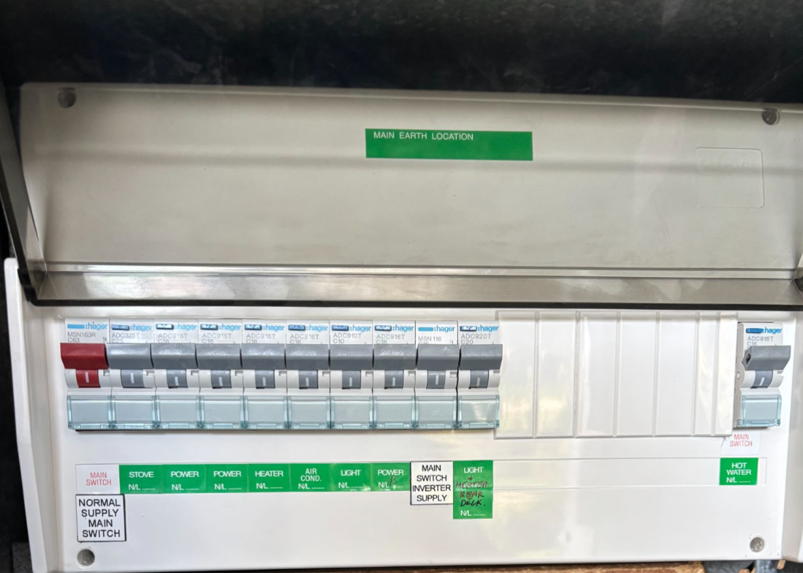

# 🏡 Notes for a fun stay at the beach house 🏡

# 🚆 Arriving

### 🔑 Keys 🔑
Are located in the lock box to the left of the front door.

### 💦 Hot Water Service 💦
Turn on the hot water service.  

⚠️ **Note:** It is an electric hot water service and does not heat immediately. It will heat some time around 2:00am - so don't expect hot water immediately.

**Hot water switch ON:**

### 🔌 Appliances 🔌

These appliances will likely be turned off when you arrive:
1. Coffee machine
2. Internet router
3. TV
4. Microwave
5. Kettle

# 😎 While you are here 😎

## 🚪 Operating the back door 🚪
The back door has an unusual key mechanism. You need to turn the key two whole 360 degree turns when locking and unlocking.

## 🗑️ Rubbish 🗑️

🚨 **IMPORTANT:** If the week is not landfill (schedule is below) then **☣️ PLEASE TAKE ALL LANDFILL RUBBISH HOME WITH YOU. **

### Bin colours
* The Green bin is for green waste
* The Yellow bin is for recycling
* The Red bin is for landfill.

Bin and green-waste liners are in the third drawer in the kitchen.

## 🔥 The Fireplace 🔥

### Lighting the fire
⚠️ Never use paper to light the fire. Instead you use kindling and fire lighters. (If you do use paper you will quickly find out why you shouldn't the first time you open the door! 🙂)

1. Use 8 pieces of kindling and lay them in a cross-hash pattern on top of each other (two left and right then two on the next layer at 90 degrees and so forth).
2. Place two fire lighters in the kindling (fire lighters are in the toilet cupboard on the top shelf). 
3. Matches are in the kitchen dresser drawer.
4. Make sure the air vent is fully open (pulled out)
5. When the flames die down on the kindling put your first piece of wood on the fire and when the wood starts to burn well shut the air vent to 50%.

#### Emptying the ash tray
Just tip the ash in the garden bed outside the sunroom.

## ☕ Coffee Machine ☕
Generally the coffee grind should be on 1. You should not need to touch it.

Towards the end of your stay try and run the beans down so there are none or as few as possible left when you leave. This saves the beans from drying out. There is a container in the refrigerator where I keep ground coffee that I have emptied out of the machine when I leave.

The machine is configured for a double shot. Please don't change it unless you know what you are doing.  😵‍💫

### 📖 To use 📖
1. Change the water in the rear reservoir.
2. Place some beans in the hopper.
3. Place the coffee portafilter into the grinder holder and press **DOSE**.
   
4. The machine will grind the correct dose of coffee. Tamp the coffee using the tamper arm on the left. A green light should appear.
5. Place the portafilter into the Group Head and then press the fill button.

## 🐶 Pets 🐶
⚠️ There are two bait traps that keep any pests away. They are in black housings to protect pets and wildlife. One is in the carport and one is under the verandah under the BBQ.

Please 💩 clean up after your pets. Put pet waste in the green bin.

## Barbeque
Sometimes we have had rodents sniffing around the BBQ at night so when we leave the BBQ is is packed so they can't explore the cooking surface. You will need to set it up before you use it. The drip tray has a slot that it slides into from the left side. We suggest you get some aluminium foil to line the drip tray.

## Outdoor chairs 
At night, please put the covers on the outdoor chairs. (This will keep the possums from making a mess of them.)

# 👋 When you leave 👋

## ☕ Kettle ☕
Please tip all water out of the kettle.

## 💧 Hot Water 💧

Turn the hot water off when you leave.

**Hot water switch OFF:**

Turn off the following appliances at the wall:
1. Kettle (Make sure you don't accidentally turn off the fridge :)
2. Coffee machine
3. Internet router
4. TV
5. Microwave

## 🚮 Bins 🚮

Place the bins out on the front nature strip to the left (looking out) of the driveway.

The Green bin goes out every week, the Yellow and Red bins on alternate weeks. 

The bin schedule is here:

## 🥩 BBQ 🥩
Please leave the BBQ in the same state that you found it in.

## 🔑 Keys 🔑
Place the keys back in the lock box and set the code to 000. Test the box to make sure it is locked properly.